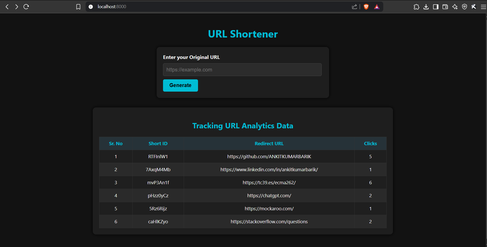

# 🚀 QuickURLShortener

A minimal and sleek URL shortener built using **Node.js**, **Express**, **MongoDB**, and **EJS**.  
Easily shorten URLs, track clicks, and analyze traffic — all from a clean UI. 🌐✨

---

<p align="center">
  
</p>

---

## 📦 Features

- 🔗 Shorten long URLs to a unique short ID.
- 📊 Track the number of visits for each URL.
- ⏱️ Store timestamp history of all clicks.
- 🎨 Built with EJS for server-side rendering.
- 📁 MongoDB-based storage for persistence.

---

## ⚙️ Tech Stack

- **Node.js** + **Express.js**
- **MongoDB** + **Mongoose**
- **EJS** (Embedded JavaScript Templates)
- **NanoID** for unique short IDs

---

## 🛠️ Setup Instructions

1. **Clone the Repository**  
```bash
git clone https://github.com/ANKITKUMARBARIK/QuickURLShortener.git
cd QuickURLShortener
```

2. **Install Dependencies**  
```bash
npm install
```

3. **Start MongoDB** (locally or use MongoDB Atlas)

4. **Run the Application**  
```bash
npm start
```

---

## 🌐 How to Use in Browser

Once your server is running (default: http://localhost:8000), here’s how you can interact with the app:

🔹 **Home Page (Create & View URLs)**  
📌 URL: [http://localhost:8000/](http://localhost:8000/)  
➡️ Use this page to shorten URLs and view tracking analytics table.

🔹 **Redirect Using Short URL**  
📌 URL: `http://localhost:8000/url/:shortId`  
➡️ This route will redirect to the original long URL and update visit history.

🔹 **Get Analytics of a Short URL**  
📌 URL: `http://localhost:8000/url/analytics/:shortId`  
➡️ This returns a JSON response with click data and timestamps.

💡 Example:  
If the generated shortId is `abc12345`, then:

- Redirect: `http://localhost:8000/url/abc12345`
- Analytics: `http://localhost:8000/url/analytics/abc12345`

---

## 📁 Folder Structure

```
├── controllers/
│   └── url.js
├── models/
│   └── url.js
├── routes/
│   └── staticRouter.js
├── views/
│   └── home.ejs
├── public/
├── .env
├── app.js / index.js
└── README.md
```

---

## 👨‍💻 Author

**Ankit Kumar Barik**  
📧 Drop a message if you liked it! Always learning. 😄

---

© 2025 QuickURLShortener. All rights reserved.
